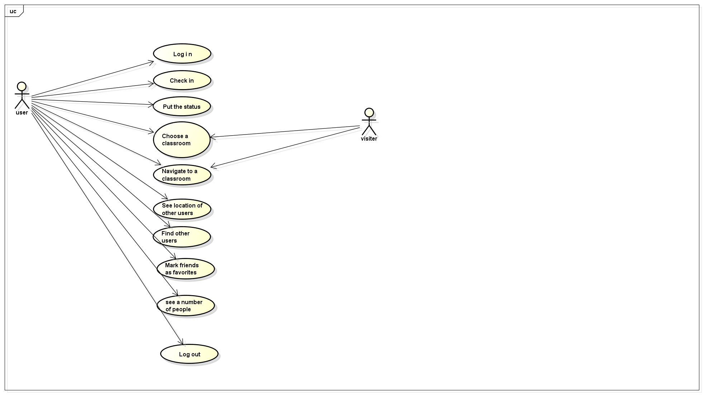

<h4>
Product name - <i>MetroNavigation</i> 
Team Name - <i>DEW</i> 
Team Member - <i>Evanfiya Logacheva, Danhua Wu</i> 
Date of the Report - <i>08.12.2013</i> 
Editors - <i>Evanfiya Logacheva, Danhua Wu</i> 
</h4>

<h4><b>1.Introduction</b></h4>

MetroNavigation is planned to be an application based on already existing Kana, a mobile application designed for identifying location at Metropolia UAS Alberga campus. The core system enables a user to see their location but after being enhanced there will be several more features such are:

a. Navigation. We consider it to be one of the major benefits of the system. Nor only it makes life of users easier, but also it can be used by visitors, who do not have an account in the system.

b. Search for other users location. This feature is especially helpful for students, who have an appointment with a teacher.  One can find another user, and see their status available/busy/away.

c. Number of people at a particular place. Basically, it means that a user can check how many of other users are available/busy  in a classroom/library/cafeteria. 

d. Mark friends as favourites. Users can keep in touch with each other by viewing on the map where their friends are.

Our enhanced application is plain and handy, easy to use by anyone who has a smartphone, except for iOs users due to the Apple policies. Nevertheless, for anyone using mobile gadgets based on Android, we guarantee the application to be efficient, fast, and reliable.

<h4><b>2.User Groups Definition</b></h4>

1.	Visitor is a user that has not registered yet. They can open the application, but they cannot log in. They can also navigate.
2.	User is one who has an account. They are entitled to check in, see location of other users, find other users, and see number of people in places, navigate to a classroom.

<h6>2.1 Use Cases and Primary Actors</h6>

| Primary Actor	| Use Cases |
| ---- | ---- |
Visitor	 | 1.	Navigate to a classroom. |
 | 2.	Choose a classroom. |
User	| 1.	Log in |
 | 2.	Log out |
 | 3.	Check in |
 | 4.	See location of other users |
 | 5.	Find other users |
 | 6.	See a number of people available |
 | 7.	Navigate to a class room |
 | 8.	Mark friends as favorites |
 | 9.	Choose a classroom |
 | 10.	Put a status available/busy/away |

<h6>2.2 User Scenario</h6>

| Steps| Details |
| ---- | ---- |
1. Initial state: | a. The user has switched on their mobile phone. |
 | b. The user has started the app. |
2. Normal flow: | a. The user logs in. |
 | b. They click "find teacher" button. |
 | c. They select the teacher they want to meet. |
3. Exceptions: | a. No connection. |
 | b. Login fails. |
 | c. The teacher has not logged in. |
 | d. Navigation does not respond. |
4. Other activities at the same time: | The user obtains a notification from a friend. |
5. The end: | The app shows that the teacher is available and their location. |

| Steps| Details |
| ---- | ---- |
1. Initial state: | a. The user has switched on their mobile phone. |
 | b. The user has started the app. |
2. Normal flow: | a. The user logs in. |
 | b. They click "Friends" button. |
 | c. They select a friend they want to meet. |
3. Exceptions: | a. No connection. |
 | b. Login fails. |
 | c. The friend has not logged in. |
 | d. Navigation does not respond. |
4. Other activities at the same time: | The user obtains a notification from another friend. |
5. The end: | The app shows that the friend is available and their location. |
6. 

##Use Case Diagram

<h4><b>3.System Architecture</b></h4>

1. Log in. A Username and a password are needed, aunthentification response.

2. Location. Get user's location and other users' location - provided by Kana.
3. Navigation is a module, which provides a user with the shortest route to some place, a map, a route on the map.

4. Database where all information about users' accounts, room's number stored.

<h4><b>4.Requirements</b></h4>

<h6>4.1 Functional System Requirements</h6>

1. Log in. A username and a password required, they are stored in the Database, and later on checked whether they are valid.
2. Check in. A user shares their location with others. Kana is used.
3. Set the status. A user chooses his status to be available/busy/away. Location is required, Kana is used.
4. Search for a classroom. Database and Kana are used.
5. Navigate to a classroom. Database, location, navigation are used.
6. See location of other users. Database, location are used.
7. Find other users. Database is used.
8. Mark friends as favorites.Database is used.
9. See a number of people available. Kana and Database are used.
10. Log out. Database is used.

    
##Flowchart

<h6>4.2 Non-functional System Requirements</h6>

<b>1. Usability</b>
To ensure that the system is easy to use our application is based on already exisiting application Kana, which proved to be handy. We have concluded, that the more simple the appplication is the better it is. Nevertheless, it is powerful enough to provide  our users with an execellent service, and store all information needed. 

On the front page there are two options, either to log in, or to proceed without it as a visitor. So nor only registered users can benefit from the application. 

<b>2.Reliability</b>

All user's information will be protected and completely private. No one except for the user can access it. 

The possible system failures are:
    1. Invalid ID or password-->Log in again, renew a password, register.
    2. Connection fail--> restart the application, check Internet connection.

<b>3.Efficiency</b>    
Although there are many users, especially on school time, we can ensure that average time that takes one to update is 5 seconds. This estimation is based on the fact that Metropolia Campus is equipped with fast Internet connection everywhere.

<h4><b>5.User Interface</b></h4>

When user just open the application, log in is required. If the log in unsuccessful, it will give the "try again" option. After log in successfully, user can choose " Friends", "Teacher", "Classroom", "Library", "cafeteria".

"Friends" button is going to show the user's friends list, and user can add, delete, add as favourite. In the friends list, it is going to show the "favourite" friends first. In this view, database is used. After choosing a friend, the location of the friend will be showed in the school's map. Meanwhile, user can select "Route there" to get the shortest route to the friend on the map. Database, Kana, navigation are used.

When user click "Teacher" button, it will show teachers that are teaching cunrrentlly loged in user and a "Search" box. Database is used. After user choose one of the teachers, program will give the teacher's status(busy, available,away), office number. Location and database needed. User can navigate to the teacher from curent location. Navigation and location are used.

"Classroom" button is going to show the user's next classroom on the map and the shortest route to there. In this view, the application is using database, Kana, and navigation. 

"Library", "Cafeteria" buttons are having the same function. Database, location, and navigation are required. When user click one of those buttons, applicaiton will show a number of users in that area. So user can decide whether to go there or not, depending on how many people there are. Also user can use our application to navigate to the Cafeteria or Library. At this point,  database, Kana, and navigation are used.

<h4><b>6.Project Management and Self Reflection</b></h4>

One of the main obstacles we faced was that we had to run the whole project in Github, which we had not used before. The problem with it was that most of the time we were working together on the same part but only one of us could submit it.

Another thing is that functional requirements were pretty complicated to describe, since we did not make the application itself - therefore, we were not able to see the real thing while writing about it. We are not entirely satisfied with it yet.

It makes it difficult to estimate workload per one person, as we worked together. Nevertheless, in a real project we will be able to plan workload wisely, as now we have gained some experience in it. According to our timetable, each of us spent 17 hours working on the project.

Working on the next project we will divide our work into tasks, that would make our labour more effecient. 

